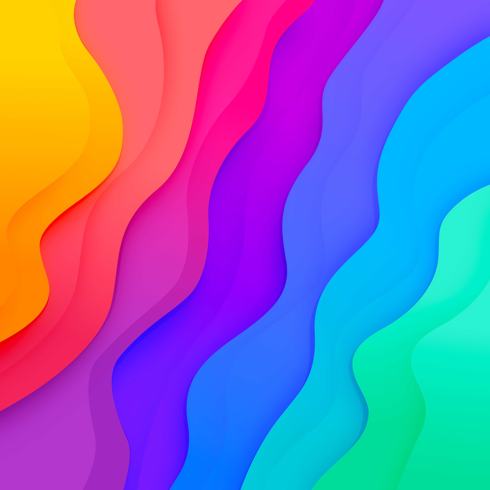
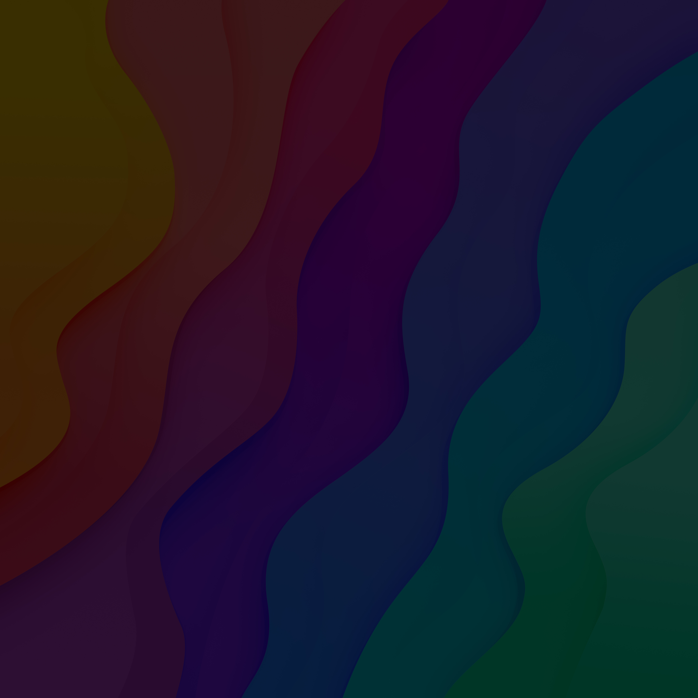

# **Wavēy**

**by Hector Simpson ([@dizzyup](https://github.com/dizzyup))**

 

This default wallpaper set was created by Hector Simpson and is available at his website at **[hector.me/wavey](https://hector.me/wavey)** for free download (along with some extra premium wallpapers if you wanna spend a couple bucks).

I've been using one of these wallpapers as a custom background for the previous new tab extension I had for a while. I also use Hector's editor/syntax theme, Hypest (albeit heavily modified).

Do check out his other projects if you're reading this.

## Previews

### Rainbow Light

### Rainbow Dark

### Aqua Light

### Aqua Dark

### Moon Light

### Moon Dark

### Shadow Light

### Shadow Dark

